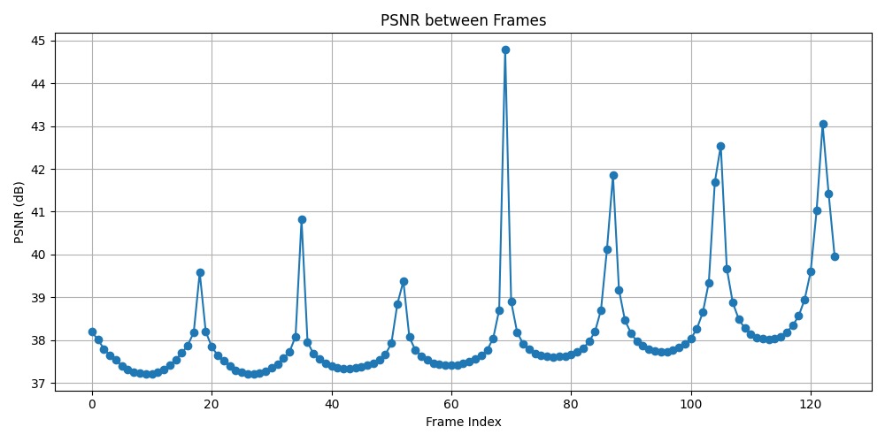
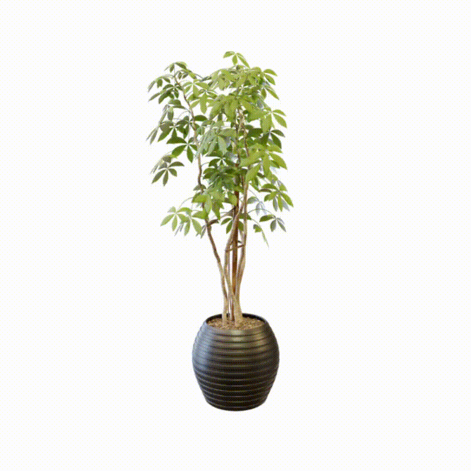
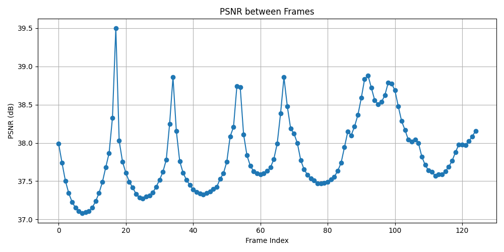
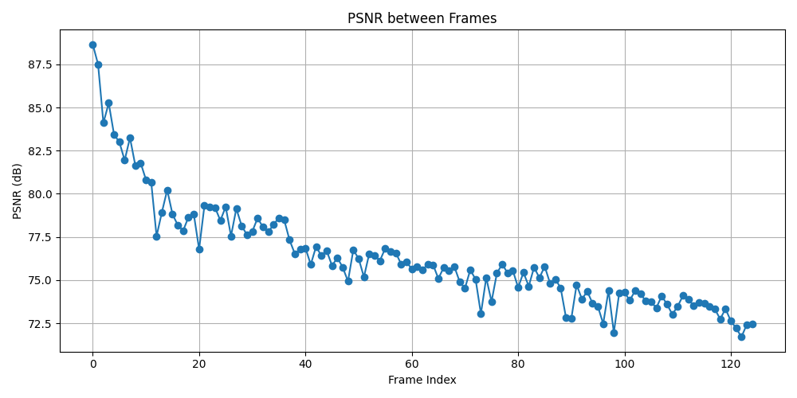
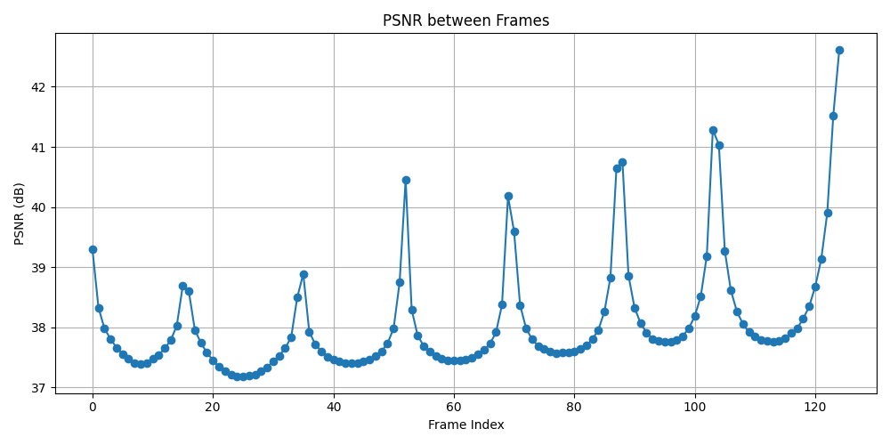
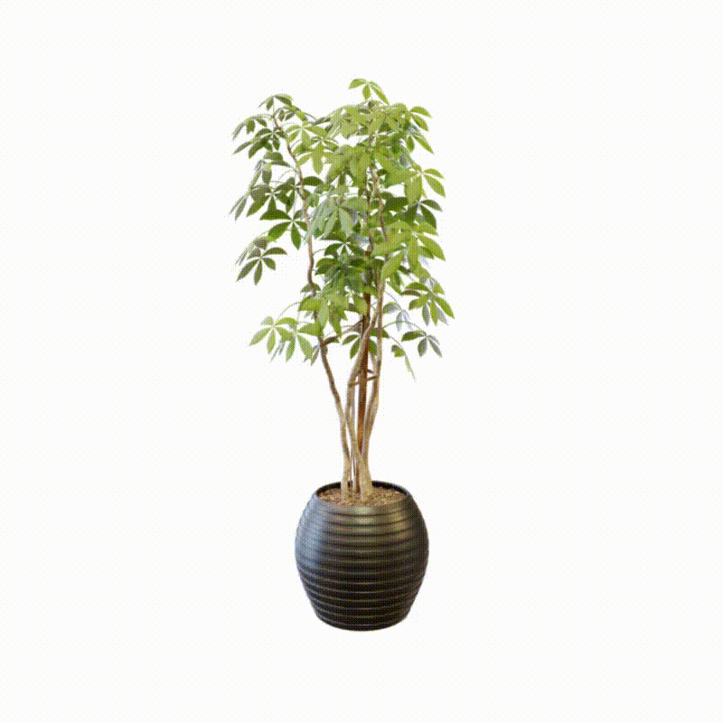
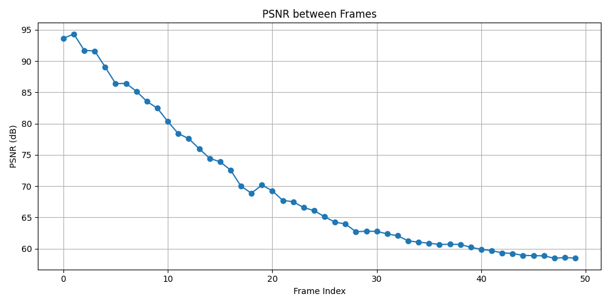
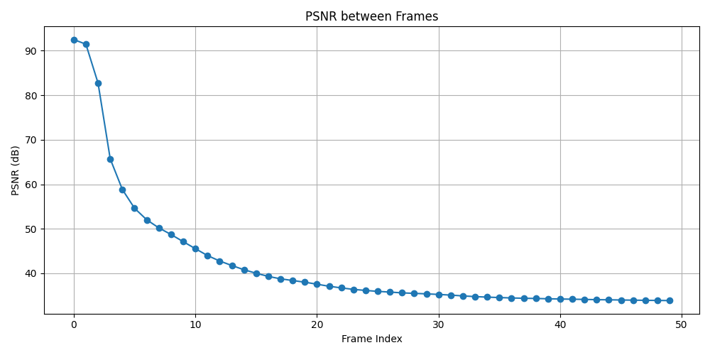
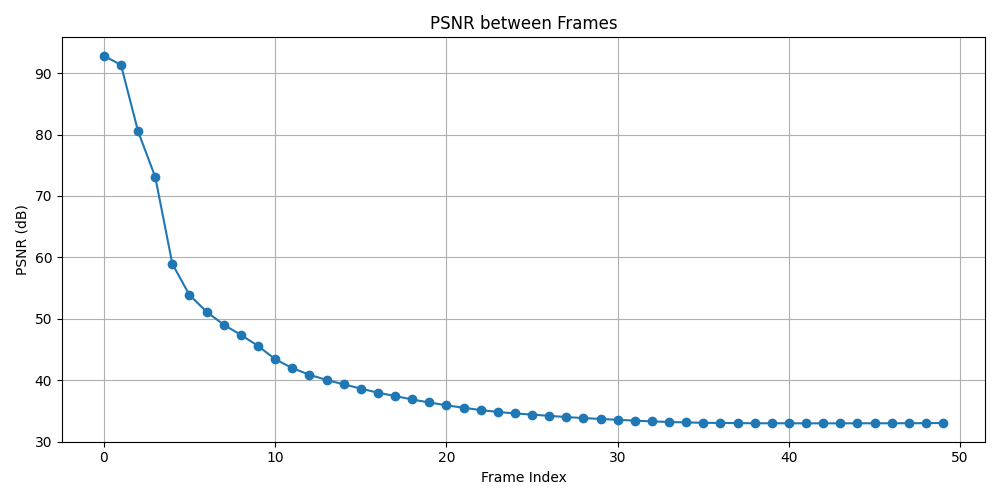
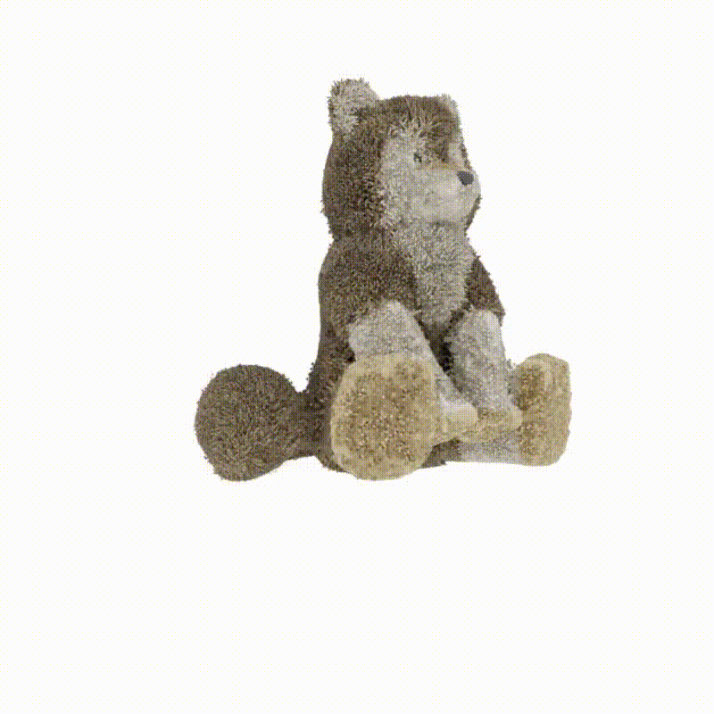

[](https://classroom.github.com/a/SdXSjEmH)
# EV-HW3: PhysGaussian

This homework is based on the recent CVPR 2024 paper [PhysGaussian](https://github.com/XPandora/PhysGaussian/tree/main), which introduces a novel framework that integrates physical constraints into 3D Gaussian representations for modeling generative dynamics.

You are **not required** to implement training from scratch. Instead, your task is to set up the environment as specified in the official repository and run the simulation scripts to observe and analyze the results.


## Getting the Code from the Official PhysGaussian GitHub Repository
Download the official codebase using the following command:
```
git clone https://github.com/XPandora/PhysGaussian.git
```


## Environment Setup
Navigate to the "PhysGaussian" directory and follow the instructions under the "Python Environment" section in the official README to set up the environment.


## Running the Simulation
Follow the "Quick Start" section and execute the simulation scripts as instructed. Make sure to verify your outputs and understand the role of physics constraints in the generated dynamics.


## Homework Instructions
Please complete Part 1–2 as described in the [Google Slides](https://docs.google.com/presentation/d/13JcQC12pI8Wb9ZuaVV400HVZr9eUeZvf7gB7Le8FRV4/edit?usp=sharing).


## Experiments

Baseline simulation videos are also provided in the [[Youtube Link]](https://youtu.be/0NR-1varKOg). I tested two different materials on two individual objects: ficus-jelly and wolf-sand.

### Physical Parameter Adjustments

The following 4 physical parameters are adjusted:
- `n_grid`: Resolution of the MPM background grid per dimension.
- `substep_dt`: Number of p2g2p substeps per frame.
- `softening`: Grid velocity damping factor (>1 accelerates dissipation; <1 decays).
- `grid_v_damping_scale`: Stress softening factor in the constitutive model.
PSNR score along the time and side by side video are given for each physical parameter adjustment.

| Parameter Adjustment | PSNR Plot | Baseline Video | Adjusted Video |
|----------------------|-----------|----------------|----------------|
| **`n_grid`: 50 → 25** <br> (Lower resolution grid reduces fidelity and introduces artifacts.) |  |  |  |
| **`substep_dt`: 1e-4 → 1e-5** <br> (Smaller time step improves stability but increases computation.) |  |  |  |
| **`softening`: 0.1 → 0.5** <br> (Increased damping leads to more visible dissipation.) |  |  |  |
| **`grid_v_damping_scale`: 0.9999 → 0.999** <br> (Higher stress damping results in a visibly softer material response.) |  |  |  |

| Parameter Adjustment | PSNR Plot | Baseline Video | Adjusted Video |
|----------------------|-----------|----------------|----------------|
| `n_grid`: 200 → 100 (Lower grid resolution may reduce sand detail and introduce instability) |  |  |  |
| `substep_dt`: 2e-5 → 1e-5 (Smaller timestep improves numerical accuracy but increases computation) |  |  |  |
| `softening`: 0.1 → 0.5 (Higher damping leads to visibly more energy dissipation and slower motion) |  |  |  |
| `grid_v_damping_scale`: 1.1 → 0.999 (Switching from stress amplification to damping results in more stable material response) |  |  |  |

---

### Discussion
**Ficus Object (Jelly Material)**  
The baseline simulation for the ficus object—composed of jelly—exhibits noticeable side-to-side oscillations due to its low internal damping. When we adjust the parameters:

- **Lowering `n_grid`, `substep_dt`, and `grid_v_damping_scale`** mitigates these oscillations. As a result, the PSNR curves corresponding to these adjustments display a characteristic **peak-and-trough pattern**: the **peaks align with maximum displacement during oscillation**, where frame-wise differences are greatest.
- Interestingly, **increasing the `softening` parameter (from 0.1 to 0.5)** does **not significantly change the oscillatory behavior**. The object still undergoes similar magnitudes of shaking. However, since oscillation naturally dampens over time, later frames of both the baseline and adjusted simulations become increasingly similar—settling closer to the object's rest position—leading to an overall **decline in PSNR**, despite no obvious visual difference.

**Wolf Object (Sand Material)**  
The wolf object, modeled as granular sand, behaves fundamentally differently. In the baseline, the object quickly **collapses into an unstructured pile**, mimicking realistic sand flow. After modifying parameters:

- Most changes—**lowering `n_grid`, `substep_dt`, increasing `softening`, or reducing `grid_v_damping_scale`**—still result in the object losing its form. In these cases, the **PSNR score decreases monotonically over time**: as the wolf crumbles, there's less structural signal and more uniformity, resulting in a loss of distinctiveness compared to the original frame.
- A notable exception is **reducing `grid_v_damping_scale` from 1.1 to 0.999**, which transforms the material response from stress amplification to damping. This adjustment significantly **preserves the structure**: the wolf no longer fully collapses but instead **drops slightly while retaining its overall shape**, resulting in much **higher PSNR scores** and a more stable visual outcome.

---

### Takeaways
PhysGaussian enables us to analyze the impact of physically meaningful simulation parameters on rendered animation fidelity in a unified, differentiable framework. From the experiments:

- **Material type dictates sensitivity to parameter changes**:  
  Soft elastic materials like jelly exhibit dynamic oscillations, which are captured in the PSNR signal through periodic peaks and decays. In contrast, granular materials like sand degrade into low-signal piles, yielding monotonically declining PSNRs.

- **Subtle parameter tuning can significantly improve physical plausibility**:  
  Especially for sand, the switch from stress amplification to damping (via `grid_v_damping_scale`) demonstrates how **small adjustments can preserve macro-structure** in otherwise collapse-prone materials.

---

### Bonus
To let PhysGaussian handle unknown materials, we can build a simple system that watches how an object moves in a video and guesses what kind of material it is made of. A neural network makes an initial guess of the material settings, like how soft or heavy it is. Then, we use PhysGaussian to simulate the motion with those settings and compare it to the real video. If it looks different, we adjust the settings step by step until the simulation matches the real one. Over time, the system learns to make better guesses for new materials by training on many examples. This way, we don’t need to set the material manually anymore.

# Reference
```bibtex
@inproceedings{xie2024physgaussian,
    title     = {Physgaussian: Physics-integrated 3d gaussians for generative dynamics},
    author    = {Xie, Tianyi and Zong, Zeshun and Qiu, Yuxing and Li, Xuan and Feng, Yutao and Yang, Yin and Jiang, Chenfanfu},
    booktitle = {Proceedings of the IEEE/CVF Conference on Computer Vision and Pattern Recognition},
    year      = {2024}
}
```
